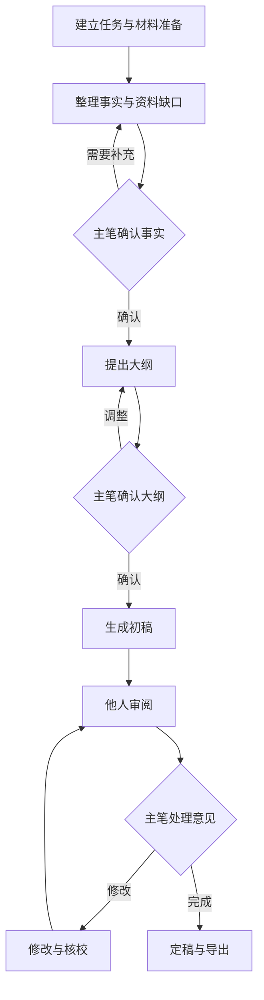

# 公文辅助协作Agent系统需求文档

版本 v0.1  日期 2026年10月7日

本系统服务单位内写作团队，优先辅助工作总结与汇报材料的资料整合和起草。系统在内网运行，通过已有 RAG 查询接口和本次任务材料获取依据，以本单位历史定稿提取文风。主笔确认事实和大纲后，Agent 生成初稿；审阅者提出意见，主笔决定如何修改和定稿。

第一版以完成一篇有依据、符合本单位表达习惯、可审阅和可导出的稿件为目标。以下“已确认”来自需求讨论；“建议”是供产品和开发评估的具体实现范围；“待确认”需要业务样例或接口说明才能定案。v0.1 可用于方案讨论，尚未冻结开发范围。

## 1 已确认的产品方向

| 事项 | 已确认内容 |
| --- | --- |
| 首批用户 | 单位内写作团队 |
| 首批场景 | 综合文字材料，先试点工作总结与汇报 |
| 首要问题 | 收集整合材料，以及提升起草质量和文风适配 |
| 协作方式 | 主笔编辑正文，其他成员供稿或审阅 |
| 起草节奏 | 先确认事实和大纲，再起草 |
| 文风依据 | 本单位历史定稿 |
| 部署边界 | 整个系统仅在内网运行 |
| 资料获取 | 可接入一个已有 RAG 系统的查询接口 |
| 试点资料 | 公开或脱敏资料 |
| 接口现状 | RAG 返回字段、权限和原文定位能力尚待核实 |

“公开或脱敏资料”限定试点输入，“内网运行”限定系统部署；两项同时适用。商业产品的公开资料用于功能参考，不作为产品运行时的互联网资料来源。

RAG 在本项目中指从已有知识库查询相关内容的服务。返回内容是否足以支撑事实引用，要根据原文、时间、口径和权限逐项判断。

## 2 产品调研与功能借鉴

调研日期为 2026年10月7日。商业产品功能依据官方说明，开源项目能力依据维护者仓库；这里记录可借鉴的设计，不把厂商宣传的提效幅度作为本系统的验收依据。

| 参考产品或项目 | 公开说明中的相关能力 | 对本系统的启发 |
| --- | --- | --- |
| WPS AI 写作 [S1] | 文体模板、初稿生成、表达风格调整；官方说明部分单位格式仍需人工处理 | 将写作内容与单位格式分开配置，初稿保留人工核稿环节 |
| 讯飞文书 [S2] | 素材筹备、分类起草、段落加工、素材来源查看、审稿核稿和格式套用 | 在编辑正文时同步查看依据，支持段落范围的修改 |
| 蓝凌 EKP [S3] | 公文起草、在线编辑、流程审批、发布，以及知识仓库 | 用角色、状态和意见处理记录组织协作 |
| gongwen-skill [S4] | DOCX 解析、格式检查与修复、模板生成、原生修订和批注 | 把文档解析、导出和修订作为独立能力评估 |
| Dify [S5] | 工作流、RAG 管线、Agent、模型管理和运行观测 | 可参考任务分步执行、模型适配与运行记录的设计 |
| RAGFlow [S6] | 文档理解、分步检索、原文引用追溯和查询接口 | 用原文片段及稳定文档标识支撑事实引用 |

Dify 和 RAGFlow 属于通用技术平台；gongwen-skill 属于文档处理工具。这些项目可以提供实现参考，团队权限、稿件版本和审阅流程仍需按本系统业务要求设计。

本阶段沿用已有 RAG 查询服务。是否采用上述开源组件，以及采用哪个版本，留到接口评估和技术方案阶段决定。Dify 仓库标明其许可证基于 Apache 2.0 并有附加条件；选用组件前需检查所选版本、依赖及字体等资产的使用条件。[S5]

## 3 用户角色与业务流程

### 角色职责

以下角色划分为建议，同一人可以承担多个角色。

| 角色 | 主要操作 | 权限边界 |
| --- | --- | --- |
| 主笔 | 建立任务、选择材料、确认事实与大纲、编辑、采纳意见、定稿导出 | 管理被授权任务的正文和版本 |
| 供稿人 | 提交本次材料、补充事实、说明数据口径 | 默认不能直接修改主稿 |
| 审阅者 | 阅读授权稿件、提出段落批注或整体意见、查看处理结果 | 默认不能直接覆盖正文 |
| 管理员 | 管理成员、接口配置、模板与文风样稿 | 内容访问权限单独配置；运维权限不自动代表可查看全部正文 |

主笔可以替供稿人上传材料。第一版不要求全员同时进入系统，也不要求多人同时编辑同一正文。

### 试点场景

示例任务为撰写某单位本年度工作总结。主笔提交本年度部门材料、写作要求和可参考的历史定稿。Agent 从本次材料与已授权 RAG 结果中整理成绩、问题和下一步工作依据，保留每项数据的期间、单位及来源。

如果两个来源分别写“完成120项”和“完成128项”，系统应展示两个原文及各自口径，并请主笔选择或补充依据。如果历史稿提到上一年度成绩，系统可以参考标题和段落组织方式，但不得把该成绩转述为本年度事实。

主笔确认事实清单后，Agent 提供大纲及每章依据。主笔调整大纲并确认，系统生成初稿。审阅者提出意见后，Agent 给出对应修改建议；主笔逐条采纳、拒绝或要求补充。定稿保留所用材料、稿件版本和意见处理记录，并导出可继续编辑的 Word 文件。

上述数值仅用于演示冲突处理，不代表真实业务数据。

### 流程状态

建议状态依次为材料准备、事实待确认、大纲待确认、起草中、审阅中、修改中、已定稿。任何阶段都允许主笔返回补充材料；返回时保留既有版本。

事实或大纲在确认后发生变化，应标出受影响的章节，要求主笔确认后再更新正文。定稿修改时建立新版本，不覆盖已经定稿的记录。

## 4 第一版范围与优先级

优先级均为建议。P0 表示试点闭环所必需，P1 表示试点后优先增强，P2 表示有明确业务需求时再评估。优先级不代表已承诺工期。

| 模块 | 优先级 | 第一版建议范围 |
| --- | --- | --- |
| 写作任务 | P0 | 写作目的、受众、期间、篇幅、要求及成员 |
| 材料接入 | P0 | RAG 查询，以及 DOCX、可提取文本的 PDF、纯文本上传 |
| 事实整理 | P0 | 原文关联、去重建议、时间口径、冲突及缺口 |
| 单位文风 | P0 | 指定历史定稿，提取规则供主笔确认 |
| 大纲与起草 | P0 | 带依据的大纲、人工确认、按章生成初稿 |
| 局部修改与核校 | P0 | 修改建议、差异预览、事实与全文一致性检查 |
| 主笔与审阅协作 | P0 | 批注、意见处理状态、正文版本与任务权限 |
| 导出与内网运行 | P0 | DOCX 导出、内网依赖、保存与失败恢复 |
| 数据表与扫描件 | P1 | XLSX 指定表区解析、扫描 PDF 的 OCR |
| 文件审阅往返 | P1 | Word 原生修订与批注，以及外部改稿导回后的比对 |
| 文风资产维护 | P1 | 多种材料的风格规则、样稿更新及质量反馈 |
| 扩展文种 | P1 | 讲话稿、发言材料、方案等，以样例评估后扩展 |
| 正式公文与 OA 对接 | P2 | 行文要素、专项格式、签批和业务系统对接 |
| 多单位商业服务 | P2 | 客户隔离、交付、计费和租户管理 |

P0 使用统一主稿，由主笔编辑、其他成员审阅。自动发文、电子签章、正式档案管理和多人同时改写正文不列入当前建议范围。未来引入涉密资料，需要另行确认部署与管理要求，不依据本次试点条件直接扩展。

## 5 核心功能需求与验收条件

以下功能细化为建议，用于评审和开发拆分。验收条件描述应观察到的行为，尚未完成实现或实测。

### FR01 写作任务和范围约束

主笔应能填写文稿类型、主题、受众、用途、统计期间、目标篇幅、必须覆盖的内容、限制事项和截止日期。系统保存这些要求并用于大纲、起草和核校。缺少关键期间或用途时，Agent 集中提出必要问题，允许主笔补充或明确暂缺。

验收：新建“本年度工作总结”后，期间和写作要求能在后续步骤查看；变更统计期间会标出已确认事实及正文需要复核，不悄悄沿用原期间。

### FR02 本次材料上传与解析

材料应保留原文件、文件版本、提供人、用途和任务归属。第一版支持 DOCX、可提取文本的 PDF 和纯文本。上传后展示解析结果，用户可以检查关键段落和表格是否完整。

验收：带标题和简单表格的 DOCX 能提取相应内容并定位回原材料。扫描件、加密文件或解析不完整时，应明确标记并允许补传文本；不能把解析失败当作材料没有相关事实。复杂合并表格的支持边界需用样例确认。

### FR03 已有 RAG 查询与检索记录

Agent 根据写作任务提出检索问题，查询经授权的资料范围，并展示命中原文。主笔可调整问题、筛选材料和排除某项结果。记录查询条件、返回时间、文档标识和可获得的文档版本。

验收：查询结果能与其原文及授权范围关联；服务异常、无命中和无权限呈现不同状态。仅有生成答案时标记为检索线索，不能自动视为已验证事实。

### FR04 事实清单和引用关系

系统应把可用于本次稿件的事实整理为清单，至少包括事实表述、期间、统计口径、来源位置和确认状态。数字还应记录单位；计算结果应保留输入值及计算方式。状态建议包括待确认、主笔确认、存在冲突和排除使用。

验收：主笔能从正文中的关键事实打开原文证据；不带来源的数据不会被自动标成确认。主笔手工补充的事实注明提供人和确认记录，待补充事实保持可见。

### FR05 重复材料 口径冲突与资料缺口

系统应提示重复叙述和潜在事实冲突，保留各来源，不擅自合并不同期间或口径的数据。针对大纲需要而材料缺少的内容，列出具体问题，如指标期间、责任部门或问题举措。

验收：同一指标的两个不同值进入冲突列表；“全年累计”和“截至某月”被视为可能口径不同。主笔选择依据后，选择结果可追溯；无法判断的内容继续标记待确认。

### FR06 本单位文风规则

主笔指定可参考的历史定稿。Agent 提取标题组织、章节顺序、常见表达、段落长度和语言正式程度，形成可编辑规则，并关联示例段落。主笔确认后，规则用于本次起草。历史定稿默认承担文风参考用途；其中事实用于本次稿件时须单独确认。

验收：能查看一条文风规则所参考的样稿段落；对同一事实可给出不同表达，保持数字、期间和主体不变。参考旧稿后，生成的本年度稿件不会自动带入旧年份的成绩或人名职务。

### FR07 具有依据的大纲与人工确认

Agent 输出章节标题、章节目的、准备使用的事实、缺口和建议篇幅。主笔能够增删、排序、修改大纲，并明确确认其版本。

验收：大纲能够指出每章依据；未确认事实清单和大纲前，不进入正式初稿生成。主笔可以排除待确认事实后继续，以待补项表示相应缺口。

### FR08 依据受控的初稿生成

系统按确认的大纲和事实生成初稿。涉及具体数字、日期、机构、人名、成绩和政策内容时应关联已确认来源；一般连接语和表达加工可由模型生成。缺少依据时使用明确的待补标记或省略相应事实，由主笔决定。

验收：测试材料缺少一项成绩数字时，初稿不会生成貌似真实的数字；历史期间不会被转换成当前期间。每章可查看所用事实和生成依据。

### FR09 局部改写与修改预览

主笔可以选择段落并提出压缩、扩展、调整语气或突出重点等要求。系统输出建议及前后差异，注明是否涉及事实变化，由主笔采纳后更新正文。支持保留原文和撤销已采纳修改。

验收：压缩段落时保留关键事实；待补数据不会在扩写中变成确定数值。建议基于旧版本生成，而主笔已修改同一段落时，系统提示冲突并要求重新比较。

### FR10 内容核校

建议检查标题与内容是否对应、统计期间和单位是否一致、同一指标前后是否矛盾、大纲要求是否遗漏、主体名称是否一致，以及表达是否符合确认过的文风规则。拼写、标点和格式规则可使用确定性检查；语义和事实关系由模型提出疑点。

验收：每项问题指出位置、依据和建议，并可采纳或忽略。系统使用“发现疑点”“未发现指定问题”等表述，不把一次模型检查表示为全部事实已正确。

### FR11 供稿与审阅意见

供稿人提交材料或补充说明。审阅者针对被授权版本提出整体意见或段落批注。主笔维护意见状态，建议为待处理、已采纳、未采纳和待沟通；未采纳时可填写理由。

验收：审阅者不能直接覆盖正文；批注关联稿件版本和段落。正文改动导致定位失效时标明原版本和待重新定位状态，不把意见错误附到其他段落。

### FR12 意见整理和辅助修改

Agent 将多条意见整理为可处理任务，保留原始意见、提出人、目标段落和可能冲突。相互矛盾的意见分别展示，由主笔选择处理方式；合并展示不删除原意见。

验收：“缩短至两千字”和“增加详细案例”能够提示篇幅冲突。一次采纳修改后可看到处理了哪些意见、还有哪些待处理；拒绝意见不会自动关闭其他相关意见。

### FR13 版本和变更影响

事实确认、大纲确认、提交审阅和定稿时保留快照。正文编辑保留历史版本，支持查看差异及恢复为新版本。事实变更后，指出相关正文需要复核。

验收：恢复旧稿产生新版本；已定稿版本保持可查看。某项事实修改后，依赖该事实的章节出现复核提醒；历史证据及审阅意见仍关联其原版本。

### FR14 定稿 导出和保存恢复

主笔显式定稿，并保留材料、事实、大纲、文风规则、正文和意见状态。提供 DOCX 导出，标题层级、正文、简单表格和页码等采用可配置单位模板。导出前汇总待补事实和未处理意见；存在关键待补事实时，允许导出标记清楚的草稿，暂不标记为定稿。

验收：导出的文件在约定版本的 Word 和 WPS 中可打开、编辑且无关键内容遗漏。引用和意见是否包含在导出文件中有清楚选项；默认正文稿不夹带内部提示词和运行日志。模型失败或任务取消不丢失已保存的正文和材料。

## 6 Agent职责和人工决策边界

“Agent”在产品中表示能够持续读取任务状态、调用授权工具并提出下一步结果的辅助执行能力。以下职责可以由一个编排器分步骤实现；是否采用多个独立 Agent 留到技术方案评估。

| 职责 | 可执行工作 | 人工确认点 |
| --- | --- | --- |
| 任务编排 | 检查输入、规划步骤、保存进度、报告失败和缺口 | 主笔确认任务目的和关键范围变化 |
| 材料整理 | 调用 RAG、解析上传文件、整理事实与冲突 | 主笔确认事实和冲突处理 |
| 结构规划 | 提出大纲及各章依据 | 主笔确认大纲版本 |
| 起草与文风适配 | 按事实、大纲和风格生成或局部修改 | 主笔采纳正文修改 |
| 核校与审阅辅助 | 提出疑点、整理意见和变更影响 | 主笔决定处理意见和定稿 |

每次执行应关联输入版本和输出结果，显示当前阶段，并可取消或从失败步骤继续。建议配置单次查询次数、生成次数和运行时限，避免无结果地反复执行；具体上限通过内网资源测试确定。

模型输出、RAG 答案和文档内容不具有修改权限。上传文档或命中材料中即使出现“调用其他地址”“修改系统规则”等文字，也只作为材料内容处理，不能改变工具和网络边界。

## 7 已有RAG和模型服务的接入要求

### RAG查询契约

下表是建议的业务契约，不预设现有服务的请求路径、字段名称或协议。开发通过适配层映射实际接口。是否支持以下能力，是接口评估的主要输出。

| 方向 | 业务字段或能力 | 缺失时的处理 |
| --- | --- | --- |
| 请求 | 查询问题、写作主题、期间、授权资料范围 | 无范围筛选时，由服务端提供与用户权限匹配的独立查询入口 |
| 请求 | 返回数量限制、请求标识、用户或服务身份 | 由适配层补充请求跟踪；不能以模型提示词代替权限控制 |
| 返回 | 原文片段、稳定文档标识、标题 | 缺少原文的结果仅作线索，关键事实需补传原材料 |
| 返回 | 页码或段落位置、内网可访问原文定位 | 无页码时可用稳定片段标识；无法核对时保持待确认 |
| 返回 | 文档日期、版本或内容指纹、检索时间 | 记录可获得的内容快照并标记日期或版本未知 |
| 返回 | 成功、无结果、超时、无权限等状态 | 转换为可识别错误，允许重试或补充材料 |
| 可选 | 相关性分数、摘要或生成答案 | 分数用于排序，答案用于辅助理解，不直接代表事实可信度 |

接口返回的字段需要覆盖业务所需的事实范围，尤其是时间、单位和口径。资料访问控制须在检索服务或受控适配层落实；不能先把无权限原文送入模型，再仅在界面隐藏。

若现有 RAG 只有答案，可先保留上传材料的起草流程。RAG 的结果应明确标记为线索；在原文证据补齐前，不能宣称已完成该路径的引用追溯验收。

### 模型服务契约

系统需要内网可访问的模型服务，至少支持文本生成、请求超时、取消或任务中止、错误状态及调用量记录。结构化输出若由模型直接产生，必须进行格式和字段校验；不符合结构时允许修复或报告失败。

内网模型的名称、服务地址、认证方式、上下文容量、并发额度和硬件资源待确认。测试应重点覆盖中文材料写作、数字与期间保持、长材料处理、文风适配和工具调用。选定具体模型前不承诺整篇生成时长或硬件配置。

### 资料分工和存储

已有 RAG 提供历史资料或背景查询。本次上传材料在任务内保存和解析，并与事实清单关联。若需要将上传材料写回知识库，需另行确认已有服务的写入能力、权限和业务流程；第一版查询接入不隐含写回功能。

正文版本、意见、事实确认记录和来源快照属于本系统任务数据。保留范围及期限由单位确定，原文已被撤销授权时的访问和历史快照策略也需在上线前明确。

## 8 工作界面和信息对象

### 界面建议

建议设置任务列表、材料与事实区、大纲区、主稿编辑区和审阅记录区。主笔从任务进入稿件，阅读正文时可以打开相关事实、原文及修改建议；审阅者默认进入所选版本的审阅界面。

阶段状态、待确认事实和未处理意见应容易找到。默认使用业务名称，例如“材料依据”“需要补充”“修改建议”，把模型调用与检索参数放在管理员配置中。

### 关键对象

| 对象 | 主要信息 | 关联关系 |
| --- | --- | --- |
| 写作任务 | 主题、类型、期间、要求、成员、状态 | 汇总本次材料、稿件和运行结果 |
| 材料与证据 | 文件或文档标识、片段、日期、版本、位置、用途 | 支撑事实或文风规则 |
| 事实 | 表述、期间、数值、单位、口径、状态、确认记录 | 关联证据和使用该事实的段落 |
| 大纲版本 | 章节、目的、依据、篇幅、确认记录 | 约束对应稿件版本 |
| 文风规则 | 写作规则、示例段落、适用文种、确认记录 | 关联参考定稿和本次任务 |
| 稿件版本 | 正文、稳定段落标识、基于哪些事实和大纲 | 关联意见、差异和导出 |
| 审阅意见 | 提出人、目标版本、定位、内容、处理结果 | 关联修改建议与主笔决定 |
| 执行记录 | 阶段、输入版本、结果、状态、时延和调用量 | 用于失败恢复和问题定位 |

## 9 非功能需求与试点验收

### 内网 权限和可靠性

建议列为 P0 的要求如下。

| 编号 | 要求 | 验收方式 |
| --- | --- | --- |
| NFR01 | 应用、模型、RAG、解析和导出依赖均在内网可用，运行时无互联网必需依赖 | 阻断外网后完成建任务、查询、起草、审阅和导出；检查无外部字体、遥测或云解析依赖 |
| NFR02 | 按任务控制文件、正文、证据和意见访问权限 | 用无权账号通过页面、直接接口和文件下载验证访问被拒绝；检查 RAG 权限边界 |
| NFR03 | 保存进度和版本；超时、取消、失败可识别且不丢失已保存成果 | 模拟模型及 RAG 超时，从失败步骤恢复，核对正文与材料 |
| NFR04 | 记录关键操作、模型与接口调用状态，业务日志避免无必要地复制全文 | 根据任务追踪确认、改稿、定稿与导出；检查日志配置 |
| NFR05 | 可备份和恢复稿件、材料、权限及关联关系 | 使用测试备份恢复完整任务，验证版本、引用和意见关系 |

用户数、同时生成任务数、文件大小及页数上限、正文长度、响应时间、备份频率、保留期和浏览器兼容范围均待确认。应在固定硬件、模型版本和样本条件下分别测量查询、解析、生成及保存时延，再确定阈值。

### 试点样本与指标

建议使用20个公开或脱敏的任务样本，包含工作总结和汇报；每个样本配备写作要求、材料、历史定稿和人工确认的事实清单。样本应覆盖材料缺失、数据冲突、旧年份数据、表格、意见冲突、接口异常及版本变化。数量和分布在试点前确认。

下列质量指标为建议目标，不表示已有实测结果。

| 指标 | 定义和建议目标 |
| --- | --- |
| 关键事实可追溯 | 人工标注并用于正文的数字、日期、主体和成绩均可追到原文或主笔确认记录；样本覆盖率目标100% |
| 事实保持 | 预置的旧年份、单位、数值和主体不可被生成或改写为其他事实；发现错误记录受影响阶段 |
| 缺口与冲突处理 | 预置关键冲突保持可见，直到主笔决定；材料不足时使用待补状态而非无依据事实 |
| 文风适配 | 两名业务审阅者按结构、标题、表达和可用性评分，采用五分制；建议至少80%的样本平均达到4分，分歧单独记录 |
| 协作完整性 | 每条意见能追到版本和处理状态，审阅者无法直接覆盖正文，恢复旧版本不破坏历史记录 |
| 导出质量 | 约定 Word 和 WPS 版本可打开和编辑；必需内容、层级和简单表格保持完整 |
| 效率改进 | 对同类任务记录人工基线与辅助流程的主笔投入时间，包括核实和返工；比较中位数，达到何种改善作为业务探索目标另定 |

验收应结合确定性检查和业务人工评审。引用存在不等于事实正确，提效指标应计入核实、改稿和补材料的时间。

## 10 分阶段交付与待确认事项

### 交付建议

第一阶段完成接口和样例评估：获取 RAG 说明、内网模型条件及一组脱敏样稿，确认可获得的原文定位和权限能力，形成接口适配方案、样例解析结果及首批文风规则。

第二阶段完成主笔写作闭环：任务、上传与查询、事实整理、确认大纲、初稿、局部改写、核校和 DOCX 导出。先用单人端到端任务验证事实关系和文风效果。

第三阶段完成团队试点：供稿和审阅角色、意见处理、版本恢复、内网断网运行及试点验收。完成后再决定是否投入 P1 数据表、扫描件和 Word 审阅往返能力。

目前没有确认预算、开发人数或截止日期，以上阶段不附带工期承诺。

### 待确认清单

| 事项 | 建议提供的信息 | 影响的决定 |
| --- | --- | --- |
| RAG 接口 | 接口说明及脱敏请求响应，认证、资料范围、原文定位、错误状态 | FR03至FR05能否完整实现 |
| 内网模型 | 已有服务或可部署模型，硬件、上下文和并发条件 | 起草质量、处理方式与性能 |
| 真实写作样例 | 一份历史定稿、一组本次材料、一份写作要求 | 首批模板、文风和试点样本 |
| 团队规模 | 主笔和审阅者人数、同时使用和生成任务数 | 部署资源、权限与性能阈值 |
| 资料形式 | 典型文件、扫描件比例、表格复杂度和最长稿件 | 解析支持边界及P1优先级 |
| 审阅习惯 | 审阅者是否进入系统、是否必须用Word批注 | FR11至FR12和文件往返范围 |
| 定稿责任 | 谁可定稿、哪些待补项需要阻止定稿 | FR14的状态与权限规则 |
| 单位模板 | Word模板、字体、标题层级及导出要求 | 导出效果与兼容验收 |
| 运行管理 | 账号来源、数据保留、备份恢复及资料撤权规则 | NFR02至NFR05 |
| 投入约束 | 预算、开发资源、预期试点日期 | 功能取舍与里程碑 |

下一步优先用一个真实但脱敏的写作任务走通业务流程，并评估 RAG 与内网模型接口。这些结果将用于把建议范围收敛为可开发、可验收的版本。

## 11 调研来源

以下均为官方产品说明或项目维护者仓库，访问日期为2026年10月7日。

- [S1 WPS AI公文写作官方说明](https://plus.wps.cn/blog/p109366.html)
- [S2 讯飞文书官方使用指南](https://gw.iflydocs.com/docs/guide/quickstart.html)
- [S3 蓝凌EKP官方产品介绍](https://www.landray.com.cn/static-old/solution/ekp/index.html)
- [S4 gongwen-skill项目仓库](https://github.com/linhut/gongwen-skill)
- [S5 Dify项目仓库](https://github.com/langgenius/dify)
- [S6 RAGFlow项目仓库](https://github.com/infiniflow/ragflow)